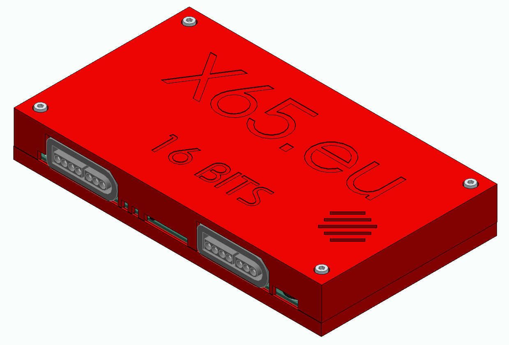

Enclosure for the x65 SBC revB-PCB
=====================================

This enclosure if for the following PCB variant:
https://github.com/jsyk/x65/tree/main/pcb/x65-sbc-revB1

The design was done in Solid Edge 2024 (Employee edition).
Test-print done with Prusa MK4 in PETG.

## Additional Parts

    4x M3 nut
    4x M3x25 bolt

## TBD improvements:
- the holes for M3 nuts in the bottom part should be hexagonal to prevent nut rotation during screwing.
- round off the vertical edges, less sharp.
